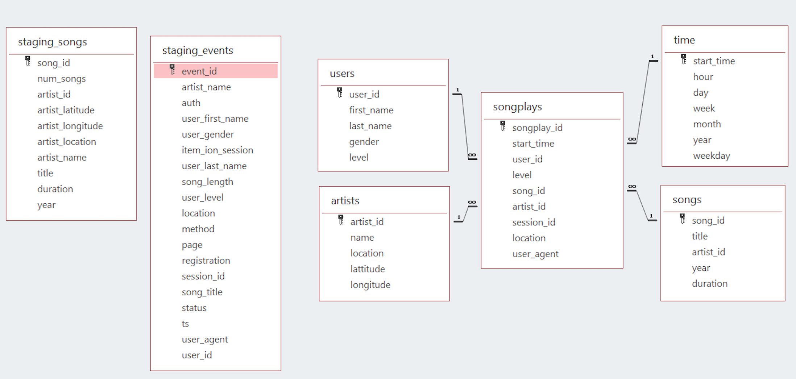

# Project summary

This is the third project of Udacitys Data Engineering Nanodegree. For this project, I am trying to help a music streaming startup company called Sparkify to move its user database and song database processes onto the cloud. More specifically, I have built an ETL data pipeline that extracts their data from Amazon S3, then stages the tables onto Amazon Redshift, and finally executes SQL statements which create the analytics tables from those data staging tables. The datasets used in this project are provided in two public Amazon S3 buckets. One bucket contains info about songs and artists, where the second bucket has info concerning actions done by users. The objects contained in both buckets are in JSON files.

### Database Schema
We have the following two staging tables that they copy the JSON file inside the S3 buckets.

### Staging Tables
- staging_songs:
    Info about songs and artists

- staging_events:
    Actions are done by users

The database schema is shown as follows

### Fact Table 
- songplays:
    Records in event data associated with song plays

### Dimension Tables
- users:
    Users in the app

- songs:
    Songs in the music database

- artists:
    Artists in the music database

- time
    Timestamps of records in songplays broken down into specific units

### Data Warehouse Configurations and Setup
- Create a new `IAM user` in your AWS account
- Give it AdministratorAccess and Attach policies
- Use access key and secret key to create clients for `EC2`, `S3`, `IAM`, and `Redshift`.
- Create an `IAM Role` that makes `Redshift` able to access `S3 bucket` (ReadOnly)
- Create a `RedShift Cluster` and get the `DWH_ENDPOIN(Host address)` and `DWH_ROLE_ARN` and fill the config file.

### ETL Pipeline
- Created tables to store the data from `S3 buckets`.
- Loading the data from `S3 buckets` to staging tables in the `Redshift Cluster`.
- Inserted data into fact and dimension tables from the staging tables.

## How to Run

1. Execute the "create_tables.py" file using terminal.
2. Run Jupiter notebook using terminal.
3. After succesfully open the Jupiter noteboomk,execute the "etl.ipynb" file.
4. Last but not least, execute the "test.ipynb" file.